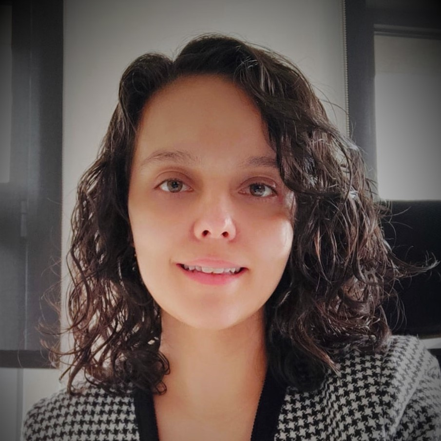
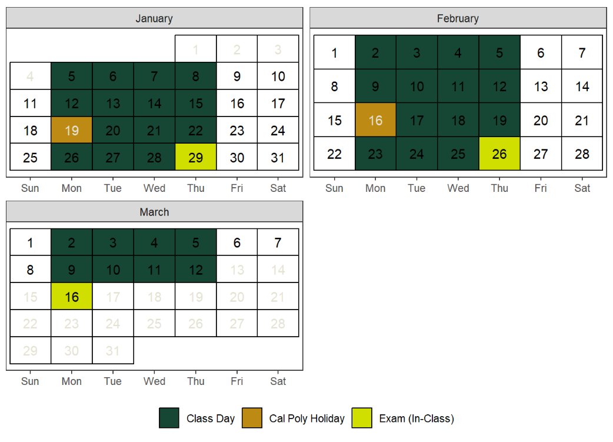
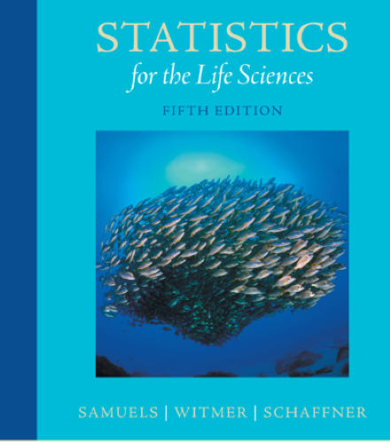
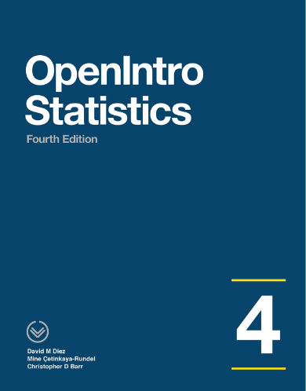
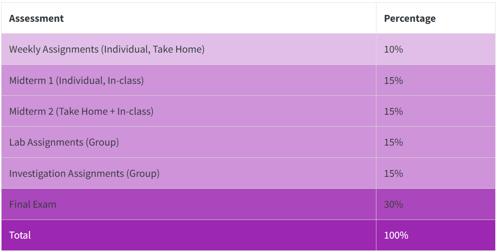
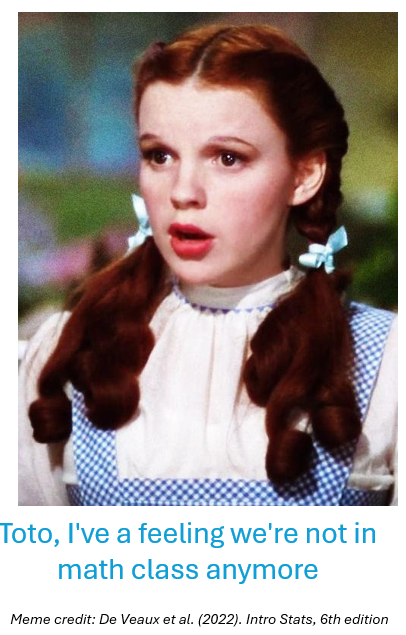
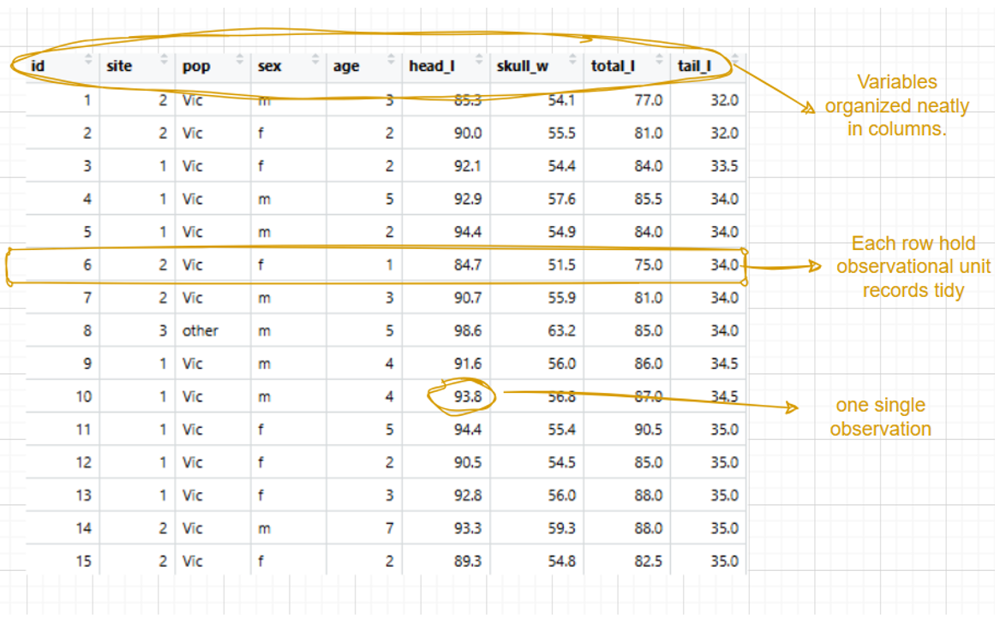
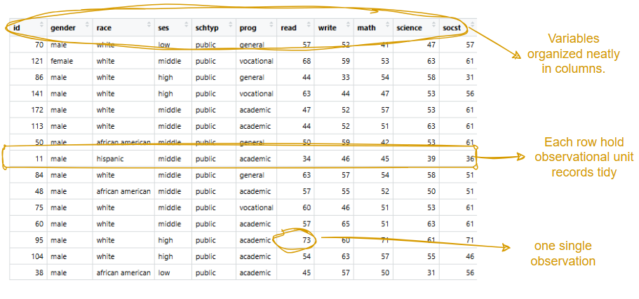

##

:::: {.columns}
::: {.column width="55%"}
::: {style="text-align: center"}

**Instructor** 

```{=html}

```

::: {style="text-align: left"}

<h1 style="font-size: 28px; margin-top: 20px;line-height: 0.5;">
[](audio/how-to-pronounce-my-name.mp3) Dr. Sinem Demirci (she/her)
</h1>

<h1 style="font-size: 28px; margin-top: 20px;line-height: 0.5;">
 <a href = "https://maps.app.goo.gl/7dTPXc1jELP4gs297" target="_blank" style="font-size: 28px; line-height: 0.5;"> 025-213</a>
</h1>

<h1 style="font-size: 28px; margin-top: 20px;line-height: 0.5;">
 <a href = "mailto:sdemirci@calpoly.edu" style="font-size: 28px; line-height: 0.5;">sdemirci@calpoly.edu</a>
</h1>

::: {style="font-size: 30px; text-align: left"}

**Instructor's office hours:**  
**Mon - Thu:** 11:10 AM - 12:00 PM _(In-Office)_    
 
:::

:::
:::
:::

::: {.column width="45%"}
::: {style="text-align: center"}


**Grader**

<br>   
<br>   

::: {style="text-align: center"}
<h1 style="font-size: 30px; margin-top: 20px;line-height: 0.5;">Eden A. Smith</h1>

<h1 style="font-size: 28px; margin-top: 20px;line-height: 0.5;">
 <a href = "mailto:esmit169@calpoly.edu" style="font-size: 28px; line-height: 0.5;">esmit169@calpoly.edu</a>
</h1>


:::
:::
:::
::::


## 
### Today's Menu

<br>

::: {style="font-size: 32px"}

In this lecture, I will be briefly talking about

1. Syllabus and Course Structure   
2. What is Statistics? 
4. A Soft Introduction to Week 1   


:::


##
### Course Website and Syllabus

<br>     
<br>    

We have a course [website](https://stat218-2026.github.io/website/) to organize and manage our course materials.


## 
### Schedule

<br>


{fig-align="center"} 


##
### Textbooks 

::: {layout-ncol=2}





:::

## 

::: {.columns}
::: {.column width="50%"}

:::

::: {.column width="50%"}
::: {style="text-align: right; font-size: 24px"}

- Where can I get a copy of this book?
  - There are few options that I found
    - Cal Poly Mustang Shop   
    -   <a href="http://lib.calpoly.edu/search-and-find/course-reserves/" target="_blank">**Course Reserves**</a>
    -  <a href="https://www.pearson.com/en-us/subject-catalog/p/statistics-for-the-life-sciences/P200000006339/9780137515011" target="_blank">**Pearson**</a> - you can subscribe for 4 months
    - **Cal Poly Textbook Facebook page:** Rumor is that there is such a Facebook page where students sell textbooks at low prices. 
    
:::
:::
:::


## 
### Assessment

{fig-align="center"} 


## 
### More on Investigations (Group Assignments)

::: {style="font-size: 32px"}

- There will be 'Investigation Sessions' **every Tuesday** to be completed (hopefully) within classroom time. 

- You are encouraged to work in groups on these assignments. **Each group should be composed of 2-3 students** to work and complete them together both in the class and/or after the class.

- It will...

  - focus more on a key statistical concept. 
  - be turned in one write-up with all of your names. 
  
- All investigation assignments are due **Thursdays by 11:59 pm**.

- You may work either the same group members or shuffle around.

:::

## 
### More on Lab Assignments

::: {style="font-size: 32px"}

- There will be 'Lab Sessions' **every Thursday** to be completed (hopefully) within classroom time.  
  - Lab sessions will be conducted in groups, and the lab assignments will also be group projects.  
  - **Each group is composed of 2-3 students** to work and complete the labs together both in the class and/or after the class.

- All lab assignments are due **Mondays by 11:59 pm**.

- You may work either the same group members or shuffle around.

- We will use R programming language.

:::

##
### In brief...

<br>

- **Monday & Wednesday:** Lecture-based approach

- **Tuesday & Thursday:** Learn-by-doing approach


## 
### A Note on Attendance and Participation

<br>

::: {style="font-size: 32px"}

**Attendance**

- I will record attendance during every lecture, not for grading purposes, but to track your learning progress in this class. 

  - In case of recurring absences, I will reach out to understand the reasons and work together to find solutions.

:::


## 
### A Note on Attendance and Participation

<br>

::: {style="font-size: 32px"}

**Participation**

- Your active involvement enriches our learning environment and enhances everyone's experience. 

  - It isn't about speaking up every day; it's about actively engaging with the material and activities. 
  
  - I respect that everyone participates in differently. 

- In brief, you must be present in our classroom (both physically and mentally) unless you have an ["Excusable" Reason for Missing Class ](https://academicprograms.calpoly.edu/content/academicpolicies/class-attendance) 

  - Please contact with me in advance if you are not coming and do your best to catch up 

:::  

# Frequently Asked Questions


##
### How can I call my professor?

<br>

::: {style="font-size: 32px"}


- Dr. Demirci (Dr. Deh-meer-jee)   
- Prof. Demirci  
- Dr. D.


:::


##
### Why didn't you answer my email?

<br>

::: {style="font-size: 32px"}

I usually respond within 48 hours. If you haven't heard back...

- Your email might have taken a detour.
- You used a personal email address, and I thought it was a secret agent (from: undercover_hero@gmail.com).
  - PLEASE USE YOUR CAL POLY EMAIL ADDRESS AND INCLUDE YOUR NAME AND THE COURSE YOU’RE IN.

- Please e-mail again after 48 hours. 


:::

##
### Is there any study guide for this course?

<br>

::: {style="font-size: 32px"}

- Study daily.
- Read the materials before coming to the lecture.
  - It’s normal—part of the learning process—not to understand every single sentence.
- Ask questions!
- Come to my office hours (coffee and chocolate might be available).

:::


##
### Can we use AI tools in this course?

<br>

- Yes and No. Please read our [AI policy](https://stat218-2026.github.io/website/academic_honesty.html) ***very carefully*** to avoid any unintended consequences.

##
### I have math anxiety (alt text: not a tech-savvy person). What can I do to pass this class?

<br>

::: {style="font-size: 32px"}

- Please talk to me!

- I’m designing this course to be more conceptual and less algebraic. You can:

  - Mute your inner critic.
  - Come and ask for help.
  - Believe in yourself.

- We can do this together!

:::

##
### What if I ask a stupid question?

<br>

::: {style="font-size: 32px"}

- There are no stupid questions!

- I love seeing the variability in your answers—it helps me understand your learning patterns and improves my lectures.

- I track participation, not correctness.

:::

##
### Are you rounding up our grades at the end of the quarter?


<br>

::: {style="font-size: 32px"}

- Nope! But during the quarter...

  - I offer extra credit opportunities.
  - I might curve grades if the class average is too low (never happened in STAT 218).

:::

##
### I am switching my major. Can you give me a B+?

<br>

::: {style="font-size: 32px"}

- REMEMBER! This is your responsibility to study this lecture and get a B+.

<br>

- I can’t help you in Weeks 7, 8, or 10, or during final weeks.

- If you’re switching majors, let me know in advance so I can provide extra office hours or materials to help you maximize your grade.


:::

##
### Why are we using the R Programming Language?

<br>

::: {style="font-size: 32px"}

- It’s a computer language used by _Homo sapiens_ to communicate with computers. Every college graduate/researcher/professional should have a basic programming literacy in the 21st century.

- We will NOT learn how to code from scratch.

- We’ll learn the nature of the language and modify basic codes by changing dataset names and variable names.

:::

##
### Do we have to shuffle our groups every week?

::: {style="font-size: 32px"}

No, but...

- Sometimes students don’t share the workload equally.
- Some group dynamics might not work.


<br>

::: fragment
If you’re happy with your group, feel free to stick together for all investigations and labs.
:::
:::

##
### Can I work individually?

::: {style="font-size: 32px"}

Yes, but...

- It could be overwhelming as tasks are designed for 2-3 people.
- You should learn how to work in a group.
- Let me know if you do not want to work alone but didn’t find any groups.

:::

## 
### What is Statistics, Dr D.?

<br>   

- If we were all exactly the same, most statistical methods would be of little use.

- But we are not!!

  - This creates situations involving *uncertainty* and *natural variation*.


## 
### What is Statistics, Dr D.?
::: columns
::: {.column width="50%"}
::: {style="font-size: 30px"}

<br>

 - **Statistics** is a collection of procedures and principles for gaining and analyzing information to educate people and help them make better decisions when faced with uncertainty.
 
 - Science of Uncertainty  
 - Science of Certainty


:::
:::

::: {.column width="50%"}

::: fragment

{fig-align="center" width=60%} 

:::
:::
:::

##
### What Are the Building Blocks of Decision Making?

<br>
<br>

***Data*** and ***evidence*** form the foundation of most decision-making processes.

##
### I keep hearing "data" everywhere. What is it?

::: {style="font-size: 32px"}

- recorded values, whether numbers or labels, together with their context are called data.    
- are often organized into a data frame  

:::

##
### Hold on, what is a "Data Frame"?

{fig-align="center"} 

## Data Sources

Data can be obtained:

- Through research
  - Experiments 
  - Observational studies 
  - …

- From information collected by public or private agencies

- From online sources (e.g., websites, databases)


## Observational Unit    

<br>
<br>

- The person or thing being measured.
- Case, study subject, experimental unit are other names for it.


## Variable  

<br>
<br>

- Any characteristic of a person or thing that can be assigned a number or category.

## Categorical Variable

- When a variable names categories and answers questions about how cases fall into those categories, it is called a __categorical variable__.

  - e.g., eye color (green, blue, brown) 
    
- may only have two possible values (like “yes” or “no”).
  - We call them binary variables.

- may be a number like a __zip code__.
 
  
## Quantitative Variable


<br>

- When a variable has measured numerical values with units and the variable tells us about the quantity of what is measured, it is called a __quantitative variable__.

- e.g., temperature (F or C), speed (mph)...


## Data Frame/Matrix Revisited

{fig-align="center"}


## But...

<br>
<br>

Data alone can’t make good decisions. We need a solid approach.

##
### You said "evidence" somewhere?

**Example:** A man on the news got mercury poisoning from eating swordfish, so the average mercury concentration in swordfish must be dangerously high.

- What type of evidence is this?
- Is it authentic and verifiable?
- Could it be an exceptional case?

##
### What is Empirical Evidence?
::: {style="font-size: 28px"}

- In applied statistics, analyses are typically based on **empirical evidence!**

To get that, one must collect data from scientific studies such as 

- **Observational study:** We merely observe things about our sample.
- **Randomized experiment:** We randomly assign people to one of two groups (variable manipulation). 
- **Survey:** We typically use to either to characterize a group or to assess opinions or reactions, e.g., political polling, for a particular group of individuals.
- And many more complicated studies within and beyond the scope of statistics (meta-analysis, qualitative research methodologies etc)...
:::

##
### What am I doing here?

<br>

::: {style="font-size: 28px"}

By the end of this course, I hope to increase your statistical literacy and data literacy. In the best-case scenario, I will support you in decision- making process and making sense of uncertainty in the 

(1) behavior of chemicals, 
(2) relationships among living organisms & communities of living organisms, 
(3) physical processes that sustain most of the living systems and 
(4) dynamics of human health, through the use of statistics.

STAT 218 is tailored for life science students who will inevitably engage with Statistics in their future professions. 

:::

##
### What about tomorrow?

<br>
<br>

Our first investigation day! Bring your laptop/iPad/Chromebook.

##
### Extra Activity

Decide on what type of study, survey, observational study or experiment?

- Who has more support among “likely voters”?
- Who uses Instagram more: men or women?
- Does smoking during pregnancy increase the risk of having a premature baby?
- Does aspirin prevent heart attacks? 


