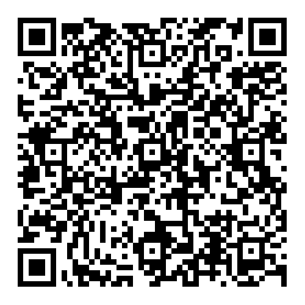
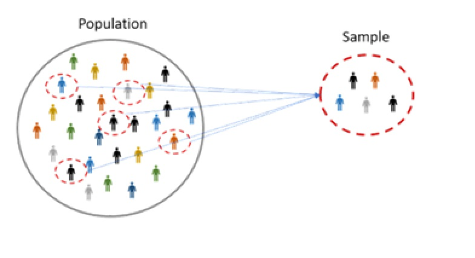
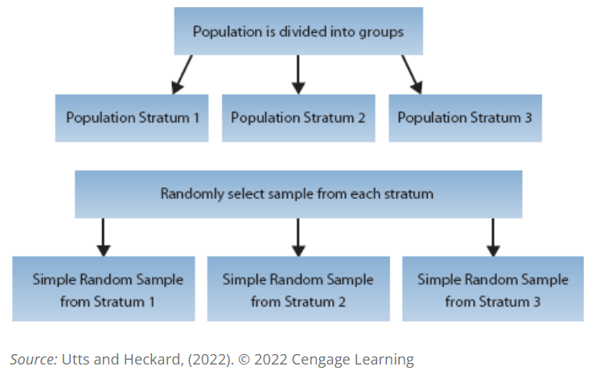
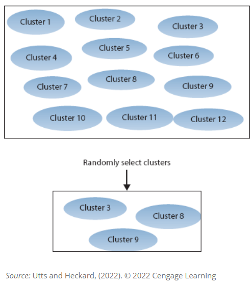

## Today's Outline 


- Counting Sheep: How Do We Sample Sleep? - In-class activity

- Types of Sampling in Statistics


## 
### Vocabulary

<br> 

We’d like to know about an entire collection of individuals, called a __population__, but examining all of them is usually impractical, if not impossible. 

So we select a smaller group of individuals, a __sample__, from the population.


# Counting Sheep: How Do We Sample Sleep? 


##
### In-class activity (15 min.)

__Instructions__

:::: {.columns}
::: {.column width="30%"}
::: {style="text-align: center"}

```{=html}


```

:::
:::

::: {.column width="70%"}
::: {style="text-align: left; font-size: 28px"}

[Link to the document here](https://docs.google.com/document/d/1EePP9ng05Yxn2gMRYcGR1GuV8IIiSJN7IeOGnyahjXQ/edit?usp=sharing)

1. Choose an _adjective + noun_ combination for your group based on today’s theme: __Space__  
2. You will be given 4 cases.
3. Read each case carefully.
4. Complete the table in the document.
5. Be ready to discuss your ideas as a class.

:::
:::
:::

##

:::: {.columns}
::: {.column width="50%"}
::: {style="text-align: left; font-size: 23px"}

__Case A__

 The campus health department wants to study students’ sleeping patterns. They obtain a complete list of all 18,000 currently enrolled students from the registrar. Using a computer program, 200 students are randomly selected from this list. The selected students are contacted by email and invited to complete a survey about their sleep habits.

__Case B__
 
 The campus health department wants to study students’ sleeping patterns, but they take a more informal approach. An employee goes to the student center one afternoon and asks 200 students who walk by to fill out a survey about their sleep habits.
:::
:::

::: {.column width="50%"}
::: {style="text-align: left; font-size: 23px"}

__Case C__

From the registrar, the health department learns that the student body is not evenly distributed: about 40% are freshmen, 28% sophomores, 20% juniors, and 12% seniors. Believing that sleep habits might differ by year in school, they divide the population into these four groups. Then they randomly select students from each group in proportion to its size — about 80 freshmen, 56 sophomores, 40 juniors, and 24 seniors — for a total sample of 200 students. The selected students are contacted by email and invited to complete a survey about their sleep habits.


__Case D__

 Instead of dividing students by grade level, the health department decides to use classrooms as the basis for their sample. They obtain a list of all class sections from the university registrar’s database and randomly select 6 classes. Researchers visit those selected classrooms during a scheduled class meeting and survey every student present about their sleep habits.


:::
:::
:::


<div style="position:fixed; bottom:20px; left:180px; z-index:1;">

```{r}
countdown::countdown(minutes = 15, seconds = 0)
```

</div> 

# Sampling in Statistics


##
### Introduction 
::: {style="font-size: 30px"}

-  If you use a proper sampling method to sample 1500 adults from an entire population of millions of adults, you can estimate fairly accurately, to within 3%, the percentage of the entire population who have a certain trait or opinion.
-  This result __doesn’t depend on__ how big the population is as long as it’s much bigger than the sample. 
- It depends only on how many are in the sample.

- That's why researchers rely on public opinion polls rather than trying to ask everyone for their opinion. 
  - much cheaper to ask 1500 people than several million,
  - takes less time to conduct a sample survey than a census, and 
  - better quality control (because fewer interviewers are needed).
  - they have more complex sampling method but it is the scope of our course.
  
:::

## Population and Sample
:::: {.columns}
::: {.column width="50%"}
::: {style="text-align: center; font-size: 30px"}

- We’d like to know about an entire collection of individuals, called a __population__, but examining all of them is usually impractical, if not impossible. 
  (e.g., all students in Cal Poly)

- So we select a smaller group of individuals, a __sample__, from the population.
  - **e.g.** 1500 (*n* = 1500) students in Cal Poly.

:::
:::

::: {.column width="50%"}
::: {style="text-align: center; font-size: 28px"}

- A subset of a larger population that accurately reflects the characteristics of the whole group is said to be _representative sample_.

- To make the sample as representative as possible, select individuals for the sample by employing randomness.




:::
:::
:::

## Simple Random Sample
::: {style="font-size: 32px"}

If a sample is determined through simple random sampling, it means that 

- Every item, subject, specimen, or observational unit in the population has an equal chance of being selected in that sample. 
 - The selection of these members of the sample are chosen independently of each other.


:::

## How to Choose A Random Sample
::: {style="font-size: 32px"}

To be able to gain benefit from employing randomness, we generally use tools to eliminate bias.

 Here are the steps for choosing a random sample of *n* observational units from a population of interest.
 
 - Determine the **sampling frame**: Give a unique ID number for each member (e.g., from 01 to 50).
 - Find a source of __random numbers__.
 - Continue until the intended sample size is reached.

**Practical Concern:** In many cases, choosing and implementing simple random sample is either difficult or impossible.

::: 

## 
### Nonsimple Random Sampling Methods

::: {style="font-size: 28px"}

- Of course, there are other random sampling options that are not simple. Two of them are:

  - **Random cluster sampling:** Remember that we gave a unique ID number for each member (e.g., from 01 to 50)
    - In random cluster sampling, unique ID numbers are assigned to clusters or groups of observational units (e.g., from 01 to 50), and then all the observational units in those clusters are recruited for the study.

  - **Stratified random sampling:** Our population of interest may consists of various **strata** (e.g., age groups, biological sex, geographical region, grade levels of students). 
    - After determining the strata, multiple simple random samples are drawn from each stratum, and these multiple samples **collectively** represent a representative sample of the population of interest.
    - It can help to solve the problem of large natural variability.

:::


## Stratified vs Cluster Sampling

::: {.columns}
::: {.column width="50%"}
::: {style="text-align: center; font-size: 18px"}


__Stratified Random Sampling__ 

:::
:::

::: {.column width="50%"}
::: {style="text-align: center; font-size: 18px"}




__Random Cluster Sampling__  


:::
:::
:::


## Stratified vs Cluster Sampling

::: {.columns}
::: {.column width="50%"}
::: {style="text-align: center; font-size: 18px"}

<a title="Dan Kernler, CC BY-SA 4.0 &lt;https://creativecommons.org/licenses/by-sa/4.0&gt;, via Wikimedia Commons" href="https://commons.wikimedia.org/wiki/File:Stratified_sampling.PNG"></a>

__Stratified Random Sampling__ 

<a href="https://commons.wikimedia.org/wiki/File:Stratified_sampling.PNG">Dan Kernler</a>, <a href="https://creativecommons.org/licenses/by-sa/4.0">CC BY-SA 4.0</a>, via Wikimedia Commons

:::
:::

::: {.column width="50%"}
::: {style="text-align: center; font-size: 18px"}

<a title="Dan Kernler, CC BY-SA 4.0 &lt;https://creativecommons.org/licenses/by-sa/4.0&gt;, via Wikimedia Commons" href="https://commons.wikimedia.org/wiki/File:Cluster_sampling.PNG"></a>

__Random Cluster Sampling__  

<a href="https://commons.wikimedia.org/wiki/File:Cluster_sampling.PNG">Dan Kernler</a>, <a href="https://creativecommons.org/licenses/by-sa/4.0">CC BY-SA 4.0</a>, via Wikimedia Commons

:::
:::
:::


## 
### Sampling Error vs Nonsampling Errors
::: {style="font-size: 24px"}

- **Sampling Error**: The discrepancy between the sample and the population of interest.
  - It is crucial to quantify this because that makes statistics one of the backbones of scientific thinking.
  - There will always be a sampling error BUT
    - If we use some nonrandom sampling techniques, sampling error will become unpredictable **(sampling bias)**
- **Nonsampling Error**: An error caused by other factors rather than sampling error.   
  - wording of the questions in a questionnaire
  - *nonresponse bias*: e.g., bias occurs because of participants who are not responding some of the questions or not returning a written survey.
  - *missing data*: e.g., experimental living organisms may die during the experiment, human subjects fail to participate in some/all of the sessions of a treatment group.
  - ...

:::

##
### Difficulties and Disasters in Sampling

__Difficulties__

1. Using the wrong sampling frame

2. Not reaching the individuals selected

3. Having a low response rate

__Disasters__

4. Getting a volunteer or self-selected sample

5. Using a convenience or haphazard sample

##
### Closure

- In theory, designing a good sampling plan is easy and straightforward. 
  - However, the real world rarely cooperates with well-designed plans, and trying to collect a proper sample is no exception. 
- If a proper sampling plan is never implemented, the conclusions can be misleading and inaccurate.
