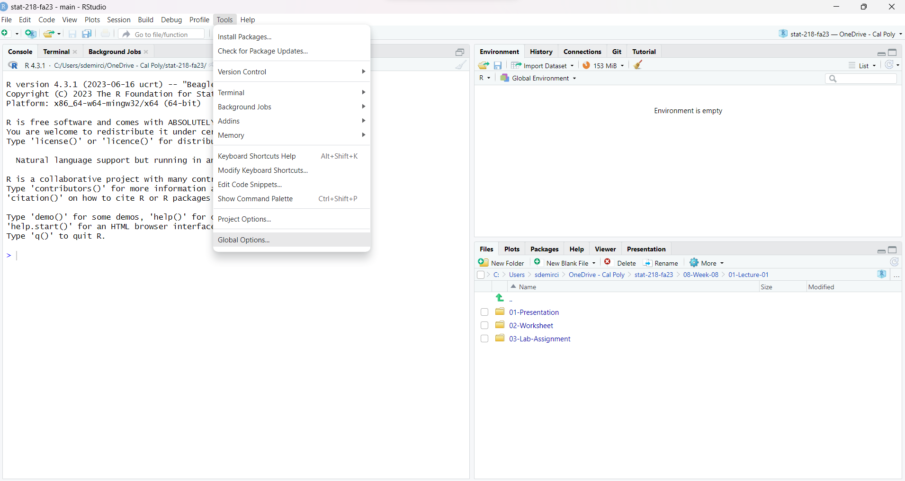
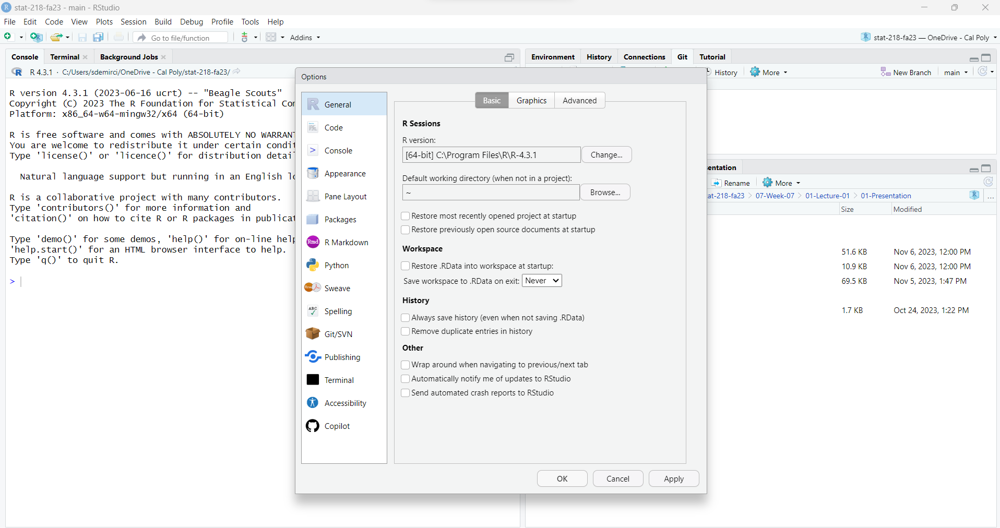
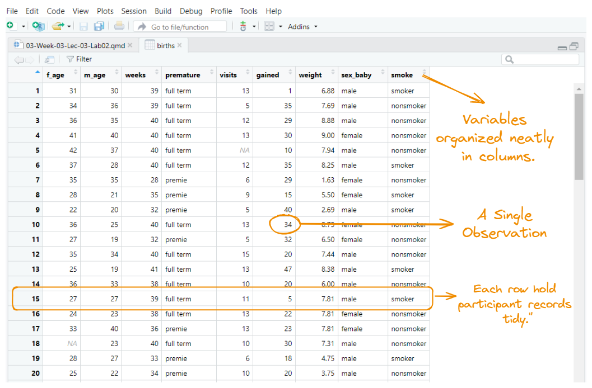
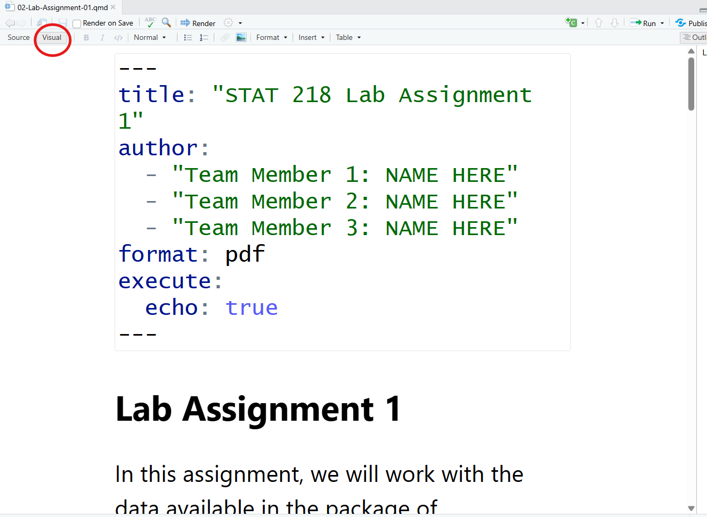

# Take Away Messages From Last Week

## 
### How to Create An Object

::: {style="text-align: left; font-size: 28px"}

<br/>

We create an object by using "<-" called as "Object Assignment Operator"

<br>

  |               | Windows        | Mac              |
  |---------------|:--------------:|:----------------:|
  | Shortcut      | Alt _and_ -    | Option _and_ -   |

:::

## 
### Vocabulary Section


```{r}
#| eval: false
#| echo: true

do(something)

```
::: {style="text-align: center; font-size: 28px"}

`do()` is a function;

`something` is the argument of the function.
:::


```{r}
#| eval: false
#| echo: true
do(something, colorful) # I can put here a comment by using hashtag
```

::: {style="text-align: center; font-size: 28px"}

`do()` is a function;   
`something` is the first argument of the function;   
`colorful` is the second argument of the function.  

R **ignores** comments if you put **#** like above
:::

<br/><br/>

::: {style="text-align: left; font-size: 18px"}
*I love  <a href="https://www.minedogucu.com/" target="_blank">**Dr. Dogucu's**</a>  teaching strategy to teach students the basics of coding. This is how she explains the idea of coding. I am using some of her strategies during this session.*
:::


##
### Before Proceeding Further...




##
### Before Proceeding Further...




## Today's Menu

<br>

:::: {.columns}
::: {.column width="50%"}
::: {style="text-align: left; font-size: 32px"}

Today I will cover:

- more functions in R
- How to Install Packages
- Loading Data into R
- Summary Statistics
- `ggplot()`

:::
:::

::: {.column width="50%"}
::: {style="text-align: left; font-size: 32px"}

Then you will...

- download your assignment    
- work in groups
- start your first assignment in R

:::
:::
::::

## A Quick note

<br>

- Next slides are just for demonstration purposes. Please DO NOT code, just watch my demo. 

- I've created a Quarto document for you, you'll download it after this demonstration.

- After that, you will work with your group members.

- You may not finish it today but you have time until Monday midnight. 


## 
### Installing a Package
::: {style="text-align: left; font-size: 30px"}

- R users can create/contribute packages, and they are free! 

- For this lab, and many others in the future, we will use:

  - The `tidyverse` “umbrella” package which has many different R packages for data wrangling and data visualization
  -   The `openintro` R package is our second textbook's package and we will use this for our lab sessions.

__AN ANALOGY:__ Packages are like toolboxes. You get them once and there's no need to buy them over and over again. Once we install these packages, we can reuse them whenever we need.

:::


## 
### The Library Function in R
::: {style="font-size: 32px"}

<br>

The `library()` function in R is like opening a toolbox __(Analogy continues)__. 

When you use the `library()` function, you're telling R to open a specific toolbox (load a package) so that you can access and use the tools inside. 

If you don’t open the toolbox, you can’t use what’s inside. In the same way, you need to use the library() function every time you want to use a package __(Analogy ends)__.

<br>


```{r}
#| echo: true
#| output: false
library(tidyverse)
library(openintro)

```

:::


## 
### How to Load Data into R

<br>

We have two different ways to do that _(within the scope of this class)_

- Using an available dataset stored in R (packages) _(we'll do that today)_
- Importing a dataset from an outside source _(around Week 7-8)_


## 

::: {style="font-size: 30px"}

I'll use a dataset from `openintro` package.

```{r}
#| echo: true
#| output: false

data("births")

```

{fig-align="center"}
:::

## 

### Getting to Know Your Data

After importing our data, it is important to familiarize with our data. We have some functions to do that. 

I'll start with `glimpse()` function. The name of this function is self-explanatory. 

```{r}
#| echo: true
#| output: true
glimpse(births)

```


## 
### Getting to Know Your Data


```{r}
#| echo: false
#| output: true
glimpse(births)

```

`glimpse()` function gives us a brief information about out data set. We have  __`r ncol(births)` variables__ and __`r nrow(births)` cases__ or __observations__.


## 

### Getting to Know Your Data

Alternatively, I can ask R the number of columns (variables) and rows (cases) as following:

```{r}
#| echo: true
#| output: true
ncol(births) ## gives us the number of columns (variables)
nrow(births) ## gives us the number of rows (cases)

```

Assume that I would like to see just the names of the variables in my data set. I can use `names()`function for this.

```{r}
#| echo: true
#| output: true
names(births)
```


## 
### Frequency Distribution Table (An Ugly One!)

<br>

I'll construct a frequency distribution table by using `count()`function. 

```{r}
#| echo: true
#| output: true
count(births, premature)

```


## 
### Measures of Central Tendency

<br>

We can calculate measures of central tendency by using these unsurprising functions. 

Pay attention to the $ sign.


```{r}
#| echo: true
#| output: true

mean(births$weight, na.rm = TRUE)
median(births$weight, na.rm = TRUE)
```


## 
### Measures of Dispersion

<br>

Standard deviation

<br>

```{r}
#| echo: true
#| output: true

sd(births$weight) # sample standard deviation

```


## 
### Measures of Central Tendency

<br>

Alternatively, I can use `summarize()` function for the same calculations.


```{r}
#| echo: true
#| output: true

summarize(births,
          mean_weight   = mean(weight, na.rm = TRUE),
          median_weight = median(weight, na.rm = TRUE),
          sd_weight     = sd(weight, na.rm = TRUE))

```


## An Example for Bar Chart

I'll plot a simple bar chart. Next session, we will explore other features for `ggplot()`.

```{r}
#| echo: true
#| output: false
ggplot(data = births,
       aes(x = premature,
           fill = premature)) + 
  geom_bar(stat = "count") +
  labs(title = "Whether the Babies Were Premature or Not",
       x = "premature",
       y = "Number of Babies"
       )
```

## An Example for Bar Chart

I'll plot a simple bar chart. Next session, we will explore other features for `ggplot()`.

```{r}
#| echo: false
#| output: true
ggplot(data = births,
       aes(x = premature,
           fill = premature)) + 
  geom_bar(stat = "count") +
  labs(title = "Whether the Babies Were Premature or Not",
       x = "premature",
       y = "Number of Babies"
       )
```


# SUMMARY OF FUNCTIONS USED TODAY


##
### How did these function work?

<br>

```{r}
#| eval: false
#| echo: true

# Replace DATASET with the name of your dataset
# Replace VARIABLE with the variable you are analyzing

# Example:
# DATASET  -> births
# VARIABLE -> weight

data("DATASET")
glimpse(DATASET)
ncol(DATASET)
nrow(DATASET)
names(DATASET)
count(DATASET, VARIABLE)
mean(DATASET$VARIABLE, na.rm = TRUE)
median(DATASET$VARIABLE, na.rm = TRUE)
sd(DATASET$VARIABLE, na.rm = TRUE)

```


# HOW CAN YOU STUDY WITH YOUR GROUP MEMBERS?

## 
#### A SUGGESTION
::: {style="font-size: 24px"}

To ensure the group’s work is divided equitably each week, your team will be rotating through a set of group roles. This ensures one person doesn’t act as the group leader for multiple sessions of class, while someone else is always the note taker. You will circulate through the following roles each week:

_Project Manager:_

- Coordinate the group's activities, ensuring tasks are assigned and deadlines are met.
- Facilitate communication within the group and with the instructor.
- Ensure the final assignment is compiled and submit it.

_Note Taker:_

- Responsible for interpreting and documenting the outputs generated from R scripts/codes.
- Take notes on key findings, insights, and interpretations derived from the data and analyses.

_Coder:_

- Lead the coding efforts, writing and managing the R scripts.
- Ensure code quality, functionality, and documentation standards are met.

:::

## 
#### A SUGGESTION

- If you work in pairs, skip the project manager role ans switch coding/note-taking every week.

- Note takers should either take notes to a paper or a Word document and add them later to the quarto document once coding part finished.

# Your Turn

##
### Today's Quarto Document


::: callout-tip

- Let's download today's Quarto document from Canvas under the LAB Assignment 1 (GROUP) titled as `02-Lab-Assignment-01.qmd`
- DO NOT FORGET to save it to your STAT 218 Folder!

:::


##
### Also...

<br>

Do not forget to open "Visual" Mode.



## How to Complete Lab Assignment 1

- Just go back and follow this slide show from the beginning of Slide 10. 

- __You will be mainly changing the name of the data set and variables.__

- Call me over if you have any questions.
