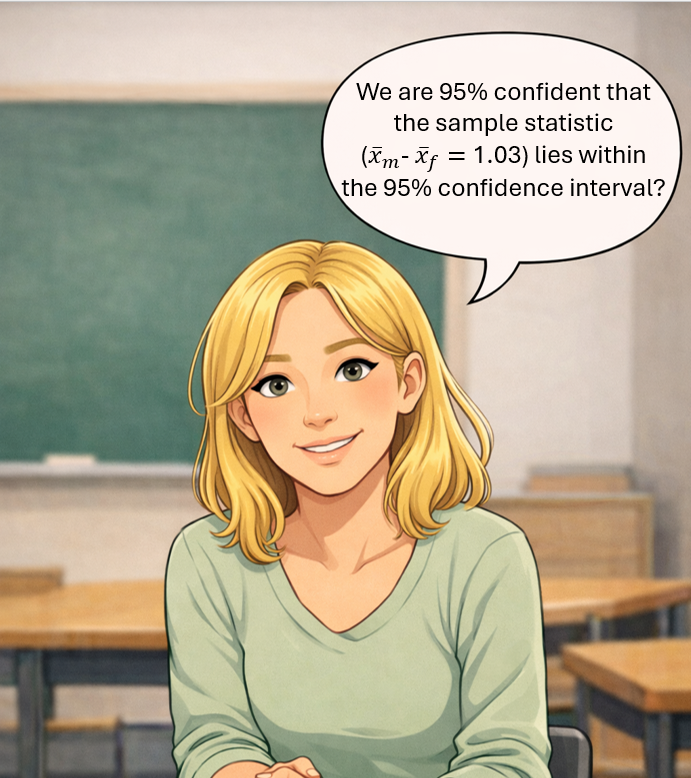

##
### Today's Menu

<br>

::: {style="font-size: 32px"}


- A quick review of the confidence interval for a single mean  
- Independent samples t-test
- Confidence interval for the difference of two population means  
- Revisiting confidence interval interpretations from the concept cartoon (if we have time)  


:::

## Introduction

<br>

::: {style="font-size: 32px"}

- In practice, most of the scientific research involves the comparison of 2 or more samples from different populations.   

- Today, we will be dealing with the comparison of 2 means

:::


# Interval Estimation for A Single Mean  

## 
### Let's Refresh Our Memory

<br>

:::::: {style="text-align: left; font-size: 28px"}

- Confidence interval is an interval of plausible values for the parameter of interest.

- A parameter is a (fixed but typically unknown) number that describes a population.

:::

::: fragment
:::::: {style="text-align: left; font-size: 28px"}

__What is the general form of a confidence interval for a parameter?__

<br>

:::
:::
:::::: {style="text-align: center; font-size: 28px"}

::: fragment

$$
statistic \pm (estimated) \ margin \ of \ error
$$
:::

::: fragment
$$
\\statistic \pm multiplier \times estimated \ SD \ of \ statistic
$$
:::
:::

::: fragment

:::::: {style="text-align: left; font-size: 28px"}


__Confidence Interval for a sample mean is...__

:::

:::::: {style="text-align: center; font-size: 28px"}


$$
\\ \bar{x} \pm t^*_{df} \ \times \ \frac{s}{\sqrt{n}} 
$$
:::
:::


##
### Let's Revisit Monarch Butterflies Example


::: {.columns}
::: {.column width="60%"}
::: {style="font-size: 26px"}

<br>

Let's assume that we examined the wing areas of 92 Monarch butterflies (_Danaus plexippus_) from the eastern North American population (df = 91 and multiplier obtained from software: $t^*$ = 1.99)

<br>

$n = 92$,  $\bar{x} = 33.36$ $cm^2$  and $s= 2.22$ $cm^2$


<br>

::: fragment

 95% confidence interval (CI) for $\mu$ is:

$$
\\ \bar{x} \pm t^*_{df} \ \times \ \frac{s}{\sqrt{n}}
\\ 33.36 \pm 1.99 \ \times \ \frac{2.22}{\sqrt{92}}
$$
:::

::: fragment
$$
\\ 95 \% \ CI = (32.90,\ 33.82)
$$
:::
:::
:::

::: {.column width="40%"}
<a title="© Derek Ramsey / derekramsey.com" href="https://commons.wikimedia.org/wiki/File:Monarch_Butterfly_Showy_Male_3000px.jpg"></a>

<br>

:::fragment
::: {style="font-size: 24px"}


__Interpretation:__ 

We are 95% confident that the population mean wing area of Monarch
butterflies from eastern North America is between 32.90 $cm^2$ and
33.82 $cm^2$.

:::
:::
:::
:::


# What Is Next?


# Interval Estimation for the Difference of Two Population Means

##
### Step 1. Understanding the Study


::: {.columns}
::: {.column width="70%"}
::: {style="font-size: 28px"}

In the previous example, we estimated the population mean wing area for Monarch butterflies from eastern North America using a sample of 92 butterflies. 

We now use the same [real study](https://doi.org/10.1155/2015/591705) to estimate the difference in population mean wing area between male and female butterflies, $\mu_{m}$ − $\mu_{f}$.

<br>

$n_m = 47,\ \bar{x}_m = 33.87 \ \text{cm}^2,\ s_m = 2.22 \ \text{cm}^2$

$n_f = 45,\ \bar{x}_f = 32.84 \ \text{cm}^2,\ s_f = 2.12 \ \text{cm}^2$


<br>

__Let's first identify these:__ 

observational unit, variable(s), parameter, statistic


:::
:::


::: {.column width="30%"}
<a title="© Derek Ramsey / derekramsey.com" href="https://commons.wikimedia.org/wiki/File:Monarch_Butterfly_Danaus_plexippus_Mating_Vertical_1800px.jpg"></a>

:::
:::


##
### Step 2. Study Design

::: {style="font-size: 28px"}


__Observational unit:__ A Monarch butterfly

__Explanatory variable:__  Male/Female (Categorical - Binary)

__Response variable:__ Wing area $(cm^2)$

__Statistical Study Type:__ Observational study

__Randomization:__ Although the original study did not mention explicitly, we will assume that the sample is representative of all butterflies in the population.

__Statistic:__ the observed difference in sample mean wing areas between male and female butterflies $\bar{x}_m$ − $\bar{x}_f$. 


__Parameter:__ the difference in population mean wing areas between male and female butterflies $\mu_{m}$ − $\mu_{f}$. (Remember this is an unknown fixed value.)

:::

##
### Step 3: But First... Explore the Data

::: {.columns}
::: {.column width="50%"}
::: {style="font-size: 28px"}


<br>

__Validity Conditions:__ The quantitative variable should have either

- a symmetric distribution in both groups, or 

- at least 20 observations in each group and the sample distributions should not be strongly skewed.

<br>
<br>

::: {style="text-align: center; font-size: 28px"}

$n_m = 47,\ \bar{x}_m = 33.87 \ \text{cm}^2,\ s_m = 2.22 \ \text{cm}^2$

$n_f = 45,\ \bar{x}_f = 32.84 \ \text{cm}^2,\ s_f = 2.12 \ \text{cm}^2$

:::
:::
:::


::: {.column width="50%"}

<br>

```{r}
library(tidyverse)
data <- read_csv("monarch_butterfly_raw_dataset.csv")
ggplot(data = data,
       aes(y = sex,
           x = wing_area_cm2))  +
  geom_boxplot()+
  labs(x = expression(Wing~Area~(cm^2)),
       y = "Biological Sex",
       title = "Wing Area of Monarch Butterflies by Sex") +
  theme_bw() +
  theme(text = element_text(size=12))
```
::: {style="font-size: 18px"}

__Remember:__ _boxplots help us identify the presence of strong skewness_
:::
:::
:::

# Step 4. Draw Inferences - Hypothesis Testing and Confidence Interval

##
### The Null and Alternative Hypotheses
::: {style="font-size: 28px"}

The hypothesis that $\mu_1$ and $\mu_2$ are not equal is called an __alternative hypothesis__ (or a research hypothesis)

$$
H_A: \mu_1 \neq \mu_2
$$


Its antithesis is the __null hypothesis__,
$$
H_0: \mu_1 = \mu_2
$$

which asserts that $\mu_1$ and $\mu_2$ are equal. A researcher would usually express these
hypotheses more informally and we can trace those hypotheses from the examples, problems and exercises in this course.

::: fragment
Alternatively we can express these hypotheses as following:

$$
\\H_0: \mu_1 - \mu_2 = 0
\\H_A: \mu_1 - \mu_2 \neq 0
$$
:::
:::


##
### Calculate test statistic
::: {style="font-size: 30px"}

<br>

- Test statistic is a measure of how far the difference between the sample means ($\bar{x}$’s) is from the difference we would expect to see if $H_0$ were true (zero difference), __the amount of variation we expect to see__ in differences of means from random samples. 

:::fragment

$$
test \ statistic = \frac{(\bar{x}_1 - \bar{x}_2) - (\mu_1 - \mu_2)}{SE(\bar{x}_1 - \bar{x}_2)}
$$
:::
:::

## 
### But What is Standard Error?

::: {style="font-size: 24px"}

The formula that we have used so far is

$$
SE_{\bar{X}} = \frac{s}{\sqrt{n}}
$$


- Naturally, we can say that taking the difference between two sample means is an estimate of the quantity ($\mu_1$ - $\mu_2$).

- However, the formula for the standard error of the difference ($\bar{X}_1$ - $\bar{X}_2$) is a little different from what we initially thought.

::: fragment

$$
SE_{\bar{X}_m - \bar{X}_f} = \sqrt{SE_m^2 + SE_f^2}
$$
:::

::: fragment

$$
SE_{\bar{X}_m - \bar{X}_f} = \sqrt{ \frac {s_m^2}{n_m} + \frac {s_f^2}{n_f}}
$$

:::

::: fragment
$$
SE_{\bar{X}_m - \bar{X}_f} = \sqrt{ \frac {2.22^2}{47} + \frac {2.12^2}{45}} ≈ 0.452
$$
:::
:::


##
### Calculate test statistic

<br>


:::fragment

$$
test \ statistic = \frac{(\bar{x}_1 - \bar{x}_2) - (\mu_1 - \mu_2)}{SE(\bar{x}_1 - \bar{x}_2)}
$$
:::

<br>

:::fragment

$$
\frac{(33.87 - 32.84) - (0)}{0.452} ≈ 2.28 \ (??) 
$$
:::


##
### Parameter Estimation - Confidence Interval


:::::: {style="text-align: left; font-size: 28px"}

<br>

General form of a confidence interval for a parameter
:::

:::::: {style="text-align: center; font-size: 28px"}

::: fragment
$$
\\statistic \pm (estimated) \ margin \ of \ error
$$

$$
statistic \pm multiplier \times \ estimated \ SD \ of \ statistic
$$

:::

<br>

::: {style="text-align: left; font-size: 28px"}

Let’s specify that for comparing two means.

:::

::: fragment
$$
\\ (\bar{x}_m - \bar{x}_f) \pm t^*_{df} \ \sqrt{\frac{s_m^2}{n_m} + \frac{s_f^2}{n_f}}
$$
:::

<br>


::::::


##
#### Step 4. Parameter Estimation


::: {.columns}
::: {.column width="70%"}
::: {style="font-size: 24px"}


95% Confidence Interval for $\mu_{m}$ − $\mu_{f}$. (multiplier obtained from software: $t^*$ = 1.99)

<br>

$n_{m}=47$ $\bar{x}_m = 33.87$ $cm^2$  and $s_m= 2.22$ $cm^2$

$n_{f}=45$ $\bar{x}_f = 32.84$ $cm^2$  and $s_f= 2.12$ $cm^2$

<br>

::: fragment
$$
\\ (\bar{x}_m - \bar{x}_f) \pm t^*_{df} \ \sqrt{\frac{s_m^2}{n_m} + \frac{s_f^2}{n_f}}
\\ 
\\ (33.87 - 32.84) \pm 1.99 \ \sqrt{\frac{2.22^2}{47} + \frac{2.12^2}{45}}
\\
\\ 1.03 \pm 0.899
$$
:::

::: fragment   
95% CI for difference in population means = (0.131, 1.929)
:::

:::
:::

::: {.column width="30%"}
<a title="© Derek Ramsey / derekramsey.com" href="https://commons.wikimedia.org/wiki/File:Monarch_Butterfly_Danaus_plexippus_Mating_Vertical_1800px.jpg"></a>

::: fragment
::: {style="font-size: 20px"}

__Interpretation__: We are 95% confident that the population mean wing area for male Monarch butterflies is between 0.13 cm² and 1.93 cm² higher than that for female Monarch butterflies in eastern North America.

:::
:::
:::
:::


## R, Please Save Me!

<br>

```{r}
#| echo: false
#| output: false
library(tidyverse)
library(infer)
mydata <- read_csv("monarch_butterfly_raw_dataset.csv")
```

```{r}
#| echo: true
#| output: true
t_test(x = mydata, 
       formula = wing_area_cm2 ~ sex, 
       order = c("Male", "Female"),
       alternative = "two-sided",
       var.equal = FALSE)
```

##
### More on Confidence Interval

:::::: {style="text-align: left; font-size: 28px"}


- This interval contains only positive values and does not contain 0.
  - Thus, we have convincing statistical evidence that the difference in mean wing areas between male and female Monarch butterflies is not 0. 
  - More specifically, we are 95% confident that the population mean wing area for male Monarch butterflies is between 0.13 cm² and 1.93 cm² higher than that for female Monarch butterflies in eastern North America.

::: fragment
- If nothing else changes when comparing two means, will the confidence interval be __narrower/wider?__ if we:
  - increase the sample size, 
  - increase the confidence level, or 
  - decrease the data variability (standard deviation) 

:::
:::
# What Does "95% Confident" Mean, Again?


##
### Student D


::: {.columns}
::: {.column width="60%"}
::: {style="font-size: 28px"}

<br>

::: fragment

This is a typical misconception. Confidence interval shows a range of plausible values that applies to population means, not individual butterflies. 

<br>

It gives us a range within which we believe the true difference in population mean wing area between male and female Monarch butterflies lies, ***not where individual wing areas fall***.
:::

:::
:::


::: {.column width="40%"}

<br>


:::
:::


##
### Student C

::: {.columns}
::: {.column width="60%"}
::: {style="font-size: 32px"}

<br>

::: fragment

<br>

Actually, we know for 100% certain that the sample statistic is the midpoint of the confidence interval.

<br>

$$
\\ (\bar{x}_m - \bar{x}_f) \pm t^*_{df} \ \sqrt{\frac{s_m^2}{n_m} + \frac{s_f^2}{n_f}}
$$
:::

:::
:::


::: {.column width="40%"}

<br>


:::
:::

##
### Student A

::: {.columns}
::: {.column width="60%"}
::: {style="font-size: 28px"}

<br>

::: fragment

This is another misconception too.

<br>

- Remember, the parameter is a fixed value. The confidence interval either contains the true difference in population mean wing area or it does not. 

- Hence, the words like 'probability' or 'chance' are not technically relevant to this particular interval.

:::

:::
:::


::: {.column width="40%"}

<br>


:::
:::


# But What Does "95% Confident" Mean?


## 
### Understanding Confidence Intervals

It is about the long-run performance of the method.


```{r setup, include=FALSE}
knitr::opts_chunk$set(echo = FALSE, fig.align = "center")
options(scipen=0)
library(fivethirtyeight)
library(scales)
```

```{r fig.height = 4, fig.align='center'}

bike_prop <- 1.03

```

<br>

::: fragment
```{r fig.height = 4, fig.align='center'}
tibble(p = bike_prop, n = 1, lower_bound = 0.13, upper_bound = 1.93) %>%
  mutate(midpoint = (lower_bound + upper_bound) / 2) %>%
  ggplot() +
  aes(x = midpoint, y = n) +
  geom_point() +
  geom_errorbarh(aes(xmin = lower_bound, xmax = upper_bound, height = .01)) +
  labs(y = " ",
       x = " ") +
  theme(axis.text.y = element_blank())
```
:::
:::: fragment
::: {style="text-align: center; font-size: 26px"}
This is the 95% CI we found as (0.13, 1.93) in the previous question.
:::
::::

## 
### Understanding Confidence Intervals
::: {style="text-align: center; font-size: 22px"}

```{r}
# install.packages("ggplot2")
library(ggplot2)

set.seed(250)

# -------------------------
# Ayarlar
# -------------------------
nCI <- 100
n1  <- 30
n2  <- 30

mu1 <- 0
mu2 <- 0
sigma1 <- 1
sigma2 <- 1

alpha <- 0.05
z <- qnorm(1 - alpha/2)

true_delta <- mu1 - mu2

# -------------------------
# 100 tekrar: estimate + 95% CI
# -------------------------
df <- data.frame(
  id = 1:nCI,
  estimate = NA_real_,
  lower = NA_real_,
  upper = NA_real_
)

for (i in 1:nCI) {
  x1 <- rnorm(n1, mu1, sigma1)
  x2 <- rnorm(n2, mu2, sigma2)

  est <- mean(x1) - mean(x2)
  se  <- sqrt(var(x1)/n1 + var(x2)/n2)
  lo  <- est - z * se
  hi  <- est + z * se

  df$estimate[i] <- est
  df$lower[i] <- lo
  df$upper[i] <- hi
}

df$y <- df$id

# -------------------------
# Grafik (tamamen siyah)
# -------------------------
ggplot(df, aes(y = y)) +
  geom_segment(
    aes(x = lower, xend = upper, yend = y),
    linewidth = 0.8,
    color = "black"
  ) +
  geom_point(
    aes(x = estimate),
    shape = 18,
    size = 1.8,
    color = "black"
  ) +
  geom_vline(
    xintercept = true_delta,
    color = "black",
    linewidth = 0.6,
    linetype = "solid"
  ) +
  theme_grey() +
  labs(x = NULL, y = NULL) +
  theme(
    axis.text.y  = element_blank(),
    axis.ticks.y = element_blank(),
    axis.text.x  = element_blank(),
    axis.ticks.x = element_blank()
  ) +
  expand_limits(y = max(df$y) + 2)

```


What would happen to the confidence intervals if we repeated this study 100 times with new random
samples?
:::

## 
### Understanding Confidence Intervals
::: {style="text-align: center; font-size: 22px"}


```{r}
# install.packages("ggplot2")
library(ggplot2)

set.seed(250)

# -------------------------
# Ayarlar
# -------------------------
nCI <- 100      # kaç tane güven aralığı
n1  <- 30       # grup 1 örneklem büyüklüğü
n2  <- 30       # grup 2 örneklem büyüklüğü

mu1 <- 0
mu2 <- 0        # istersen fark görmek için mu2 <- 0.2 gibi yap
sigma1 <- 1
sigma2 <- 1

alpha <- 0.05
z <- qnorm(1 - alpha/2)  # 95% için 1.96

true_delta <- mu1 - mu2  # gerçek mu1 - mu2

# -------------------------
# 100 tekrar: estimate + 95% CI üret
# -------------------------
df <- data.frame(
  id = 1:nCI,
  estimate = NA_real_,
  lower = NA_real_,
  upper = NA_real_
)

for (i in 1:nCI) {
  x1 <- rnorm(n1, mean = mu1, sd = sigma1)
  x2 <- rnorm(n2, mean = mu2, sd = sigma2)

  est <- mean(x1) - mean(x2)
  se  <- sqrt(var(x1)/n1 + var(x2)/n2)  # Welch SE
  lo  <- est - z * se
  hi  <- est + z * se

  df$estimate[i] <- est
  df$lower[i] <- lo
  df$upper[i] <- hi
}

# gerçek değeri kapsıyor mu?
df$miss <- !(df$lower <= true_delta & true_delta <= df$upper)
df$y <- df$id

# -------------------------
# Grafik
# -------------------------
p <- ggplot(df, aes(y = y)) +
  geom_segment(
    aes(x = lower, xend = upper, yend = y, color = miss),
    linewidth = 0.8
  ) +
  geom_point(
    aes(x = estimate, color = miss),
    shape = 18, size = 2
  ) +
  geom_vline(xintercept = true_delta, color = "orange", linewidth = 0.6) +
  scale_color_manual(
    values = c(`FALSE` = "#00BFC4", `TRUE` = "#F8766D"),
    guide = "none"
  ) +
  theme_grey() +
  labs(x = NULL, y = NULL) +
  theme(
    axis.text.y  = element_blank(),
    axis.ticks.y = element_blank(),
    axis.text.x  = element_blank(),
    axis.ticks.x = element_blank()
  ) +
  expand_limits(y = max(df$y) + 6)

print(p)

```

About 95 of those intervals would contain the true difference between the two population means _(assuming the vertical line represents the true parameter)_.

:::


##
### Understanding Confidence Interval

::: {style="text-align: center; font-size: 20px"}

```{r}
# install.packages("ggplot2")
library(ggplot2)

set.seed(250)

# -------------------------
# Ayarlar
# -------------------------
nCI <- 100
n1  <- 30
n2  <- 30

mu1 <- 0
mu2 <- 0
sigma1 <- 1
sigma2 <- 1

alpha <- 0.05
z <- qnorm(1 - alpha/2)

true_delta <- mu1 - mu2

# -------------------------
# 100 tekrar: estimate + 95% CI üret
# -------------------------
df <- data.frame(
  id = 1:nCI,
  estimate = NA_real_,
  lower = NA_real_,
  upper = NA_real_
)

for (i in 1:nCI) {
  x1 <- rnorm(n1, mu1, sigma1)
  x2 <- rnorm(n2, mu2, sigma2)

  est <- mean(x1) - mean(x2)
  se  <- sqrt(var(x1)/n1 + var(x2)/n2)
  lo  <- est - z * se
  hi  <- est + z * se

  df$estimate[i] <- est
  df$lower[i] <- lo
  df$upper[i] <- hi
}

df$miss <- !(df$lower <= true_delta & true_delta <= df$upper)
df$y <- df$id

# -------------------------
# Rastgele 1 CI seç (üçüncü renk)
# -------------------------
set.seed(999)
highlight_id <- sample(df$id, 1)
df$is_highlight <- df$id == highlight_id

# -------------------------
# Grafik
# -------------------------
p <- ggplot(df, aes(y = y)) +

  # Mevcut iki renk (miss TRUE / FALSE)
  geom_segment(
    aes(x = lower, xend = upper, yend = y, color = miss),
    linewidth = 0.8
  ) +
  geom_point(
    aes(x = estimate, color = miss),
    shape = 18, size = 2
  ) +

  # ÜÇÜNCÜ RENK: rastgele seçilen CI (üstüne çiziliyor)
  geom_segment(
    data = df[df$is_highlight, ],
    aes(x = lower, xend = upper, yend = y),
    linewidth = 1.1,
    color = "purple"
  ) +
  geom_point(
    data = df[df$is_highlight, ],
    aes(x = estimate),
    shape = 18,
    size = 3,
    color = "purple"
  ) +

  geom_vline(xintercept = true_delta, color = "orange", linewidth = 0.6) +

  scale_color_manual(
    values = c(`FALSE` = "#00BFC4", `TRUE` = "#F8766D"),
    guide = "none"
  ) +

  theme_grey() +
  labs(x = NULL, y = NULL) +
  theme(
    axis.text.y  = element_blank(),
    axis.ticks.y = element_blank(),
    axis.text.x  = element_blank(),
    axis.ticks.x = element_blank()
  ) +
  expand_limits(y = max(df$y) + 6)

print(p)

```

Normally, we wouldn’t know whether our CI was red or blue but our confidence interval might be this?
:::

##
### Understanding Confidence Interval

::: {style="text-align: center; font-size: 20px"}

```{r}
# install.packages("ggplot2")
library(ggplot2)

set.seed(250)

# -------------------------
# Ayarlar
# -------------------------
nCI <- 100
n1  <- 30
n2  <- 30

mu1 <- 0
mu2 <- 0
sigma1 <- 1
sigma2 <- 1

alpha <- 0.05
z <- qnorm(1 - alpha/2)

true_delta <- mu1 - mu2

# -------------------------
# 100 tekrar: estimate + 95% CI üret
# -------------------------
df <- data.frame(
  id = 1:nCI,
  estimate = NA_real_,
  lower = NA_real_,
  upper = NA_real_
)

for (i in 1:nCI) {
  x1 <- rnorm(n1, mu1, sigma1)
  x2 <- rnorm(n2, mu2, sigma2)

  est <- mean(x1) - mean(x2)
  se  <- sqrt(var(x1)/n1 + var(x2)/n2)
  lo  <- est - z * se
  hi  <- est + z * se

  df$estimate[i] <- est
  df$lower[i] <- lo
  df$upper[i] <- hi
}

df$miss <- !(df$lower <= true_delta & true_delta <= df$upper)
df$y <- df$id

# -------------------------
# Rastgele 1 CI seç (üçüncü renk)
# -------------------------
set.seed(99)
highlight_id <- sample(df$id, 1)
df$is_highlight <- df$id == highlight_id

# -------------------------
# Grafik
# -------------------------
p <- ggplot(df, aes(y = y)) +

  # Mevcut iki renk (miss TRUE / FALSE)
  geom_segment(
    aes(x = lower, xend = upper, yend = y, color = miss),
    linewidth = 0.8
  ) +
  geom_point(
    aes(x = estimate, color = miss),
    shape = 18, size = 2
  ) +

  # ÜÇÜNCÜ RENK: rastgele seçilen CI (üstüne çiziliyor)
  geom_segment(
    data = df[df$is_highlight, ],
    aes(x = lower, xend = upper, yend = y),
    linewidth = 1.1,
    color = "purple"
  ) +
  geom_point(
    data = df[df$is_highlight, ],
    aes(x = estimate),
    shape = 18,
    size = 3,
    color = "purple"
  ) +

  geom_vline(xintercept = true_delta, color = "orange", linewidth = 0.6) +

  scale_color_manual(
    values = c(`FALSE` = "#00BFC4", `TRUE` = "#F8766D"),
    guide = "none"
  ) +

  theme_grey() +
  labs(x = NULL, y = NULL) +
  theme(
    axis.text.y  = element_blank(),
    axis.ticks.y = element_blank(),
    axis.text.x  = element_blank(),
    axis.ticks.x = element_blank()
  ) +
  expand_limits(y = max(df$y) + 6)

print(p)

```

Or this?
:::

##
### Student B - Correct Answer

::: {.columns}
::: {.column width="60%"}
::: {style="font-size: 30px"}

<br>

::: fragment


<br>

We are 95% confident that the population mean wing area for Monarch butterflies is between 0.13 cm² and 1.93 cm² higher than that for female Monarch butterflies in eastern North America.

Over many repeated samples, this method captures the true population parameter about 95% of the time.


:::

:::
:::


::: {.column width="40%"}


:::
:::

##
### Key Takeaways 

- Confidence interval for ($\mu_1 \ - \mu_2$) gives an interval of plausible values for the __difference__ in population means.

- Pay attention to whether the confidence interval is entirely positive or negative, or includes 0.

- Always check validity conditions before constructing and interpreting a confidence interval.


