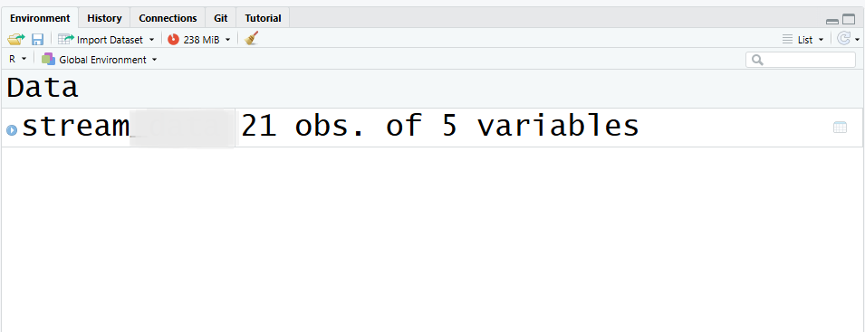

# Let's Remember Hypothesis Testing Steps

## 
#### Revising the Steps of Hypothesis Testing 

<br>
<br>

:::{.callout-important}

1. Construct the Hypotheses of $H_0$ and $H_A$
2. Check the assumptions
3. Compute test statistic and find the _p_-value (Interpreting R Output)
4. Draw conclusion.

:::


## 
### To-do List Before Start - I
::: {style="font-size: 26px"}
- Assign your roles.
  
_Project Manager:_

  - Follow the slides and give directions to the coder and note taker.
  - Facilitate communication within the group and with the instructor.

_Note Taker:_

  - Take notes on key findings, insights, and interpretations derived from the data and analyses.

_Coder:_

  - Lead the coding efforts, writing and managing the R scripts.
  - Ensure code quality, functionality, and documentation standards are met.

:::

## 
### To-do List Before Start - II

::: {style="font-size: 26px"}

1. Download the assignment from Canvas (Lab Assignment 4).  
2. Download the dataset from Canvas.   
  - **Mac Users**: Downloading a `.csv` file from Canvas can be tricky. Try opening it in a new tab to download.
  - **Windows Users:** Congratulations, you are privileged and blessed! Your `.csv` file should download without a fight (hopefully).   
  - **Important**: Even if you manage to download it, please *do not open it* on your computer. Mac sometimes automatically changes the file extension (yes, really!), which makes it harder to import with this lab's code.

3.Save both files to your `STAT 218` folder (**VERY IMPORTANT**). Otherwise, you won’t be able to import the dataset.      
4. Ensure your assignment and dataset are in the same folder, with file extensions `.qmd` and `.csv`.    
5. Follow the instructions on this slideshow to complete the assignment.    

:::


##
### Running Library Function and Loading Dataset


Let's run `library` functions and load the data sets that we will use today.

```{r}
#| output: false
#| echo: true
library(tidyverse)
stream <- read_csv("stream.csv")
```

##

__IMPORTANT!__: If you don't see `stream` in your Environment Pane, this means that your dataset and quarto file are not in the same folder! CALL ME OVER!



## OR...

You may have downloaded `stream.csv` multiple times, so its name could look like `stream (2)(1).csv`.

<br>

Check the file name, correct it if necessary, and try again. Remember, R is very stubborn—it won’t read the data if the name doesn’t match exactly what you typed in your code.


# Paired Samples $t$-test


## 
__Example of a Case:__ Pollutants in a stream may accumulate or attenuate as water flows down the stream. In a study to monitor the accumulation and attenuation of fecal contamination in a stream running through cattle rangeland, monthly water specimens were collected at two locations along the stream over a period of 21 months.

The data set `stream` the total coliform count (MPN/100ml) for a water specimen.

Perform a __paired sample $t$-test__ to assess whether the mean total coliform count is consistent across the two locations.

## 
### Assumptions - Validity Conditions
::: {style="font-size: 28px"}

- It is always important to check first whether the conditions are reasonable in a given case.

- Here is the list of conditions that we should be aware of for paired sample $t$-test.

__1) Random Sampling:__ The pairs (or subjects) should come from a random sample OR The treatment conditions should be randomly assigned (in experiments),

__2) Independence of Observations:__ the pairs should be independent of other pairs (One subject’s pair of measurements should not influence another subject’s pair.).

⚠️ Important distinction:

Measurements within a pair are NOT independent (that’s why we use a paired test).

But the pairs themselves must be independent.


__3) Normality of the Differences:__ At least 20 pairs (i.e., at least 20 differences) and the distribution of the sample differences is not strongly skewed.

:::

## 
#### Checking the Normality Assumption
::: {style="font-size: 28px"}

- Check your sample size first! 
  - Relatively small, so we should check Shapiro-Wilk test.  
  
- Shapiro–Wilk Test is a statistical method that provides a numerical assessment of evidence for certain types of nonnormality in data.

  - The procedure’s mechanics are complex, but statistical software packages simplify the testing process.
Output and Interpretation:

- The output of the Shapiro–Wilk test includes a P-value.
Interpretation:

  - P-value < 0.001: Very strong evidence for nonnormality.
  - P-value < 0.01: Strong evidence for nonnormality.
  - P-value < 0.05: Moderate evidence for nonnormality.
  - P-value < 0.10: Mild or weak evidence for nonnormality.  

:::
  
##

- _This output is from a calculation of Shapiro-Wilk test. We generally use Shapiro-Wilk test for relatively smaller sample size because visuals can be misleading in smaller sample sizes. Please interpret Shapiro-Wilk $p$-value._

::: fragment
Shapiro-Wilk normality test

data:  stream$Difference
W = 0.9641, p-value = 0.6022
:::

##
### t_test vs. t.test

- If you notice, we used `t_test()` function so far while conducting independent samples _t_-test by using `infer` package.

- Now, we will use `t.test()` which is available default in R (And some BIO courses use this too). 


## 
### Interpreting the Output - Question 4.2

```{r}
#| echo: true
#| output: true

t.test(stream$upstream, stream$downstream, paired = TRUE)

```

## 
### Interpreting the Output - Question 4.3

```{r}
#| echo: true
#| output: true

t.test(stream$difference, mu = 0)

```

##
### Question 4.4

<br>

::: {style="font-size: 28px"}

__Compare and contrast how the codes in Question 4.2 and Question 4.3 work.__ Comment on the 

- p-value, 
- test statistic, and 
- confidence interval. 

If they produce the same results, explain what the two codes did differently.

```{r}
#| echo: true
#| output: false

t.test(stream$upstream, stream$downstream, paired = TRUE)

t.test(stream$difference, mu = 0)

```

:::

##
### Question 4.5

<br>
<br>

__Conclusion:__ _Type your conclusion statement to your assignment!_

__Confidence Interval:__ _Type your confidence interval statement to your assignment!_


